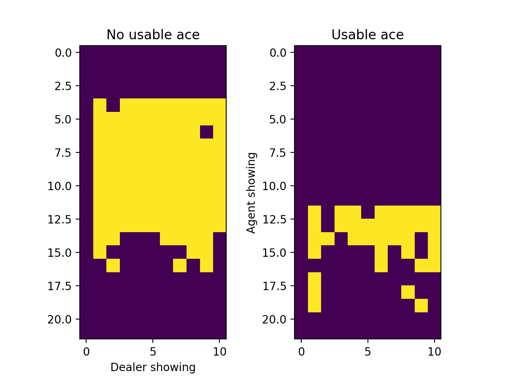

# BlackJack-RL

This is my first RL agent using a Monte Carlo method. First we generate an episode. Then loop back through each step and
assign each state value pair the current value of the expected reward. Once an episode is completed the current policy is
updated to be greedy with respect to the current action values. Here is the optimal policy after 20000 games:



## Getting Started

Simply run the script to train the agent and generate a graph of the results.

``
python3 monte.py
``

### Prerequisites
numpy, matplotlib
```
pip3 install numpy
pip3 install matplotlib
```
## Running the tests

Explain how to run the automated tests for this system

### Break down into end to end tests

Explain what these tests test and why

```
Give an example
```

### And coding style tests

Explain what these tests test and why

```
Give an example
```

## Authors
Tristan Shah
## License

This project is licensed under the MIT License - see the [LICENSE.md](LICENSE.md) file for details
